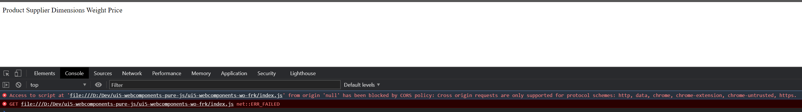
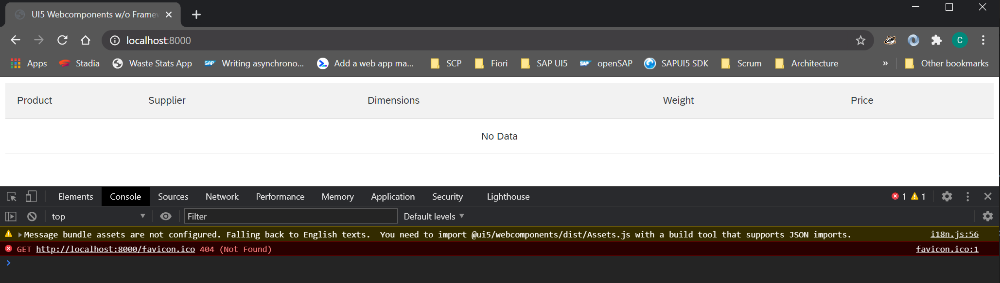
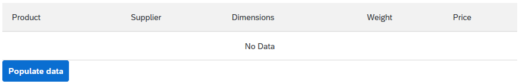
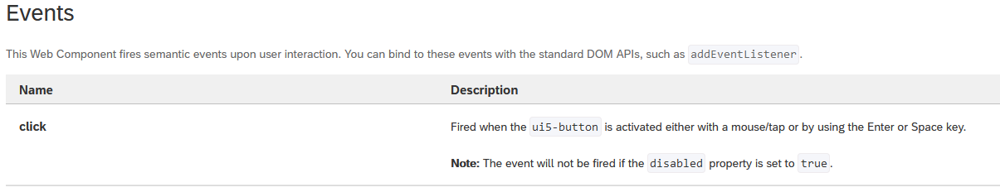
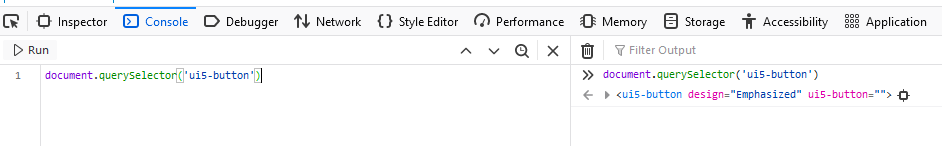
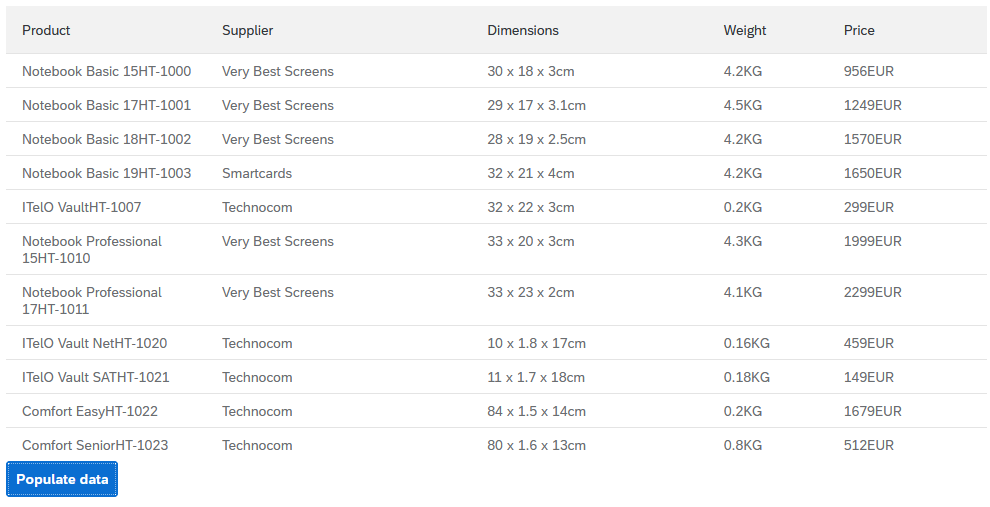

# Using UI5 Web Components w/o any framework

This is a pure "academic" project to get a better understanding of how to use [UI5 Web Components](https://sap.github.io/ui5-webcomponents/) without any framework such as React, Angular or Vue.
My goal is to create blog series during which we will cover following topics
 * Getting started with UI5 Web Components
 * Enhancing our example using `<template>` tag
 * Let´s create a bundle using webpack
 * I hate todo lists, so we create a shopping list example :wink:
 * Additional topics such as i18n, theming and create your own UI5 Web Components

# Getting started with UI5 Web Components 
 
## First baby steps
This blog is a result of something I hacked together during SAP TechEd 2020. I wanted to get a first understanding how UI5 Web Components work and how I can use them.
The excellent [blog post](https://blogs.sap.com/2020/12/02/beyond-sapui5-and-sap-fiori-elements-appendix-to-teched-session-iis114/?source=social-Global-SAPdevs-TWITTER-MarketingCampaign-Developers-Fiori-spr-4273717682&campaigncode=CRM-XB20-MKT-DGEALL) from [Marius Obert](https://github.com/IObert) made me curios but I am not much familiar with React, Angular or Vue. I wanted to keep things simple. As I am more a hands-on person (#HandsOnSAPDev), I get an itch to start building stuff once I understand (or think I understand :wink:) the basic concepts.

What we will do in this first blog is to create simple webapp that will contain a UI5 table and button.
The button will trigger displaying data in our table.

At the end it should look like the table example provided on the official documentation [UI5 Web Components Table](https://sap.github.io/ui5-webcomponents/playground/components/Table/) component.

__WARNING!__
I am using modern JavaScript syntax that might not work with older browsers. Please use a modern browser :wink:

### Get started

So let's get our hands dirty by initializing our project using [npm](https://www.npmjs.com/):
```sh
mkdir ui5-webcomponents-wo-frk
cd ui5-webcomponents-wo-frk
npm init -y
```

We will create an HTML and a JavaScript file to keep things separate. By things I mean describing the form of the content (HTML) and the actual logic (JavaScript).

Before that we should actually know how we can create a UI5 Web Component. Looking at the [official documentation](https://sap.github.io/ui5-webcomponents/playground/docs/how-to-use/#create) there are two ways to create a UI5 Web Component instance:
* Using HTML tags defined by the Web Component
* Using the HTML DOM API e.g. [createElement](https://developer.mozilla.org/en-US/docs/Web/API/Document/createElement)

Alright, let's do that and create our HTML file. To speed things up, I copied the table from the official documentation :wink: .

Nothing fancy here. We declare a table and create the columns. No table rows or cells yet to actually display any product data.

```html
<html>

<head>
    <title>UI5 Web Components w/o Framework</title>
    <meta charset="UTF-8">
    <meta name="viewport" content="width=device-width, initial-scale=1.0">
    <meta http-equiv="X-UA-Compatible" content="ie=edge">
</head>

<body>
    <div>
        <ui5-table id="productsTable" no-data-text="No Data" show-no-data>
            <ui5-table-column slot="columns" style="width: 12rem">
                <span style="line-height: 1.4rem">Product</span>
            </ui5-table-column>

            <ui5-table-column slot="columns" min-width="800" popin-text="Supplier">
                <span style="line-height: 1.4rem">Supplier</span>
            </ui5-table-column>

            <ui5-table-column slot="columns" min-width="600" popin-text="Dimensions" demand-popin>
                <span style="line-height: 1.4rem">Dimensions</span>
            </ui5-table-column>

            <ui5-table-column slot="columns" min-width="600" popin-text="Weight" demand-popin>
                <span style="line-height: 1.4rem">Weight</span>
            </ui5-table-column>

            <ui5-table-column slot="columns">
                <span style="line-height: 1.4rem">Price</span>
            </ui5-table-column>
        </ui5-table>
    </div>
    
</body>

</html>
```

Yes we did it! We used the UI5 Web Components successfully in our HTML page. Or did we?


Well we are not there yet. Just because there is a tag does not mean the browser knows what to with it.
We have to let the browser know the tag and how it should be rendered (UI5 and Fiori style please).

UI5 Web Components are delivered as [ES6 Modules](https://www.javascripttutorial.net/es6/es6-modules/). In order to use the modules we actually need to get them.
So we run:
```sh
npm install @ui5/webcomponents
```

Now we have the UI5 Web Components in the `node_modules` folder. Great. Hmmm, opening the page in your favourite web browser still shows only errors in the console.
!ADD IMAGE HERE
What we have to do is that the needed UI5 Web Components are actually loaded. Looking at the [documentation](https://sap.github.io/ui5-webcomponents/playground/components/Table/) we find the following statements.

```js
import "@ui5/webcomponents/dist/Table.js";
import "@ui5/webcomponents/dist/TableColumn.js";
```

Perfect, now we know what to do but we are still not clear where to put this code.
Reading again this [tutorial](https://www.javascripttutorial.net/es6/es6-modules/) we realize that we have to create a JavaScript file in which we place the import statements.
We want to keep the JavaScript files in a different folder so we create one real quick
```sh
mkdir src
```

We also create a new file `index.js` and add the import statements in there. Nothing else. In addition, we have to load the JavaScript in our HTML document.
```html
<body>
...
</table>
<script type="module" src="./src/index.js"></script>
</body>
```

Finally! We are ready to see our beautiful UI5 table any seconds now...



**WHAAAATTTT?**

This error tells us we can't just load js files who are importing ES6 modules when simply opening the html file in a browser.
So I guess we need a local web server to run our UI5 Web Components app. NPM to the rescue!
At the time of hacking this stuff together I was looking for an easy to use local webserver which supports ES6 modules. The one I used previously in non OpenUI5 projects did not work (or I would have to do some config stuff which I did not want to mess around with).

There a many options to choose from but I found the [Web Dev Server](https://modern-web.dev/docs/dev-server/overview/) and it worked out of the box. That's all I wanted :relaxed: for now.
Most important is that the imported ES6 modules can be resolved by this web server without the need to involve any bundlers like [Webpack](https://webpack.js.org/), [Snowpack](https://www.snowpack.dev/), [Rollup](https://rollupjs.org/guide/en/), [Parcel](https://parceljs.org/), ... . We will take a look at bundlers in a later blog post.

To use it we will install it as a dev dependency
```sh
npm i --save-dev @web/dev-server
```

Let's the package.json and add an npm command to start the server
```json
...
"scripts": {
    "start": "wds --node-resolve --watch --open"
  },
...
```

Now all that's left todo is to run the command and see the "magic happen" :satisfied:
```sh
npm run start
```



Jippie, we finally see our empty table :wink: . It seems like a bit of an effort but once you got the basics setup you are prepared for implementing the real thing.

Ok now we can add some data to our table. As a starter we will load the data from a local .json file (Fetching data from our beloved [NorthWind OData Service](https://services.odata.org/V4/Northwind/Northwind.svc/) will be added later)
```json
[
    {
        "Product": "Notebook Basic 15HT-1000",
        "Supplier": "Very Best Screens",
        "Dimensions": "30 x 18 x 3cm",
        "Weight": "4.2KG",
        "Price": "956EUR"
    },
    {
        "Product": "Notebook Basic 17HT-1001",
        "Supplier": "Very Best Screens",
        "Dimensions": "29 x 17 x 3.1cm",
        "Weight": "4.5KG",
        "Price": "1249EUR"
    },
    {
        "Product": "Notebook Basic 18HT-1002",
        "Supplier": "Very Best Screens",
        "Dimensions": "28 x 19 x 2.5cm",
        "Weight": "4.2KG",
        "Price": "1570EUR"
    },
    {
        "Product": "Notebook Basic 19HT-1003",
        "Supplier": "Smartcards",
        "Dimensions": "32 x 21 x 4cm",
        "Weight": "4.2KG",
        "Price": "1650EUR"
    },
    {
        "Product": "ITelO VaultHT-1007",
        "Supplier": "Technocom",
        "Dimensions": "32 x 22 x 3cm",
        "Weight": "0.2KG",
        "Price": "299EUR"
    },
    {
        "Product": "Notebook Professional 15HT-1010",
        "Supplier": "Very Best Screens",
        "Dimensions": "33 x 20 x 3cm",
        "Weight": "4.3KG",
        "Price": "1999EUR"
    },
    {
        "Product": "Notebook Professional 17HT-1011",
        "Supplier": "Very Best Screens",
        "Dimensions": "33 x 23 x 2cm",
        "Weight": "4.1KG",
        "Price": "2299EUR"
    },
    {
        "Product": "ITelO Vault NetHT-1020",
        "Supplier": "Technocom",
        "Dimensions": "10 x 1.8 x 17cm",
        "Weight": "0.16KG",
        "Price": "459EUR"
    },
    {
        "Product": "ITelO Vault SATHT-1021",
        "Supplier": "Technocom",
        "Dimensions": "11 x 1.7 x 18cm",
        "Weight": "0.18KG",
        "Price": "149EUR"
    },
    {
        "Product": "Comfort EasyHT-1022",
        "Supplier": "Technocom",
        "Dimensions": "84 x 1.5 x 14cm",
        "Weight": "0.2KG",
        "Price": "1679EUR"
    },
    {
        "Product": "Comfort SeniorHT-1023",
        "Supplier": "Technocom",
        "Dimensions": "80 x 1.6 x 13cm",
        "Weight": "0.8KG",
        "Price": "512EUR"
    }
]
```
Our button to start populating the table with our data is still missing. So let's add the [UI5 Web Components button](https://sap.github.io/ui5-webcomponents/playground/components/Button/).
First things first. Let's import the button and then add the HTML tags.

[src/index.js](./src/index.js)
```javascript
import "@ui5/webcomponents/dist/Button";
```

Inside the [index.html](index.html) we place the button directly underneath the table.
```html
...
    <div>
        <ui5-button id="ui5Button" design="Emphasized">Populate data</ui5-button>
    </div>
...
```

If we open our browser with the local dev web server session we will know see this



But how do we populate the data once button is clicked? Let's take a look at the [documentation](https://sap.github.io/ui5-webcomponents/playground/components/Button/) again. If you scroll all the way down you can see the available events for the ui5 button. It also provides a solution how we can bind to the click event.



Now we "just" have to get the ui5 button from the DOM and register an event listener.
Fetching elements from the [DOM](https://developer.mozilla.org/en-US/docs/Web/API/Document_Object_Model) can be done by using methods of the [Document Web API](https://developer.mozilla.org/en-US/docs/Web/API/Document). 

We will use the powerful [querySelector](https://developer.mozilla.org/en-US/docs/Web/API/Document/querySelector) method to get our ui5 button. If you want to learn more about CSS selectors that can be used [take a look here](https://www.w3schools.com/cssref/css_selectors.asp).

```javascript
const ui5Button = document.querySelector('ui5-button')
```

Before we continue we should check if this actually works. Open our browser with the local dev web server session. Open up the development tools of your browser and run ```document.querySelector('ui5-button')``` in the console.



Ok great this works. Now we can continue with adding the event listener.

```javascript
import "@ui5/webcomponents/dist/Table.js";
import "@ui5/webcomponents/dist/TableColumn.js";
import "@ui5/webcomponents/dist/Button";
import "@ui5/webcomponents/dist/TableRow.js";
import "@ui5/webcomponents/dist/TableCell.js";

const ui5Button = document.querySelector('ui5-button')

ui5Button.addEventListener('click', addData)

async function addData() {
    const response = await fetch('./data/products.json')
    const products = await response.json()

    const table = document.querySelector('ui5-table')

    products.forEach(product => {
        const tableRow = document.createElement('ui5-table-row')

        for (const [key, value] of Object.entries(product)) {
            const tableCell = document.createElement('ui5-table-cell')
            tableCell.innerHTML = value
            tableRow.append(tableCell)
        }
        table.appendChild(tableRow)
    });
}
```
Ok we actually did a lot of things in just a few lines of code. Let me guide you through
1. We use the [Fetch API](https://developer.mozilla.org/en-US/docs/Web/API/Fetch_API) to load data from our JSON file containing the products.
2. We have to add the data into the cells of the ui5 table. In order to add anything to the table we need to have access to it first. We use the querySelectormethod again.
3. Now comes the interesting part. Just like regular html tables the ui5 table has rows and cells. We create a row for each product and a cell for each property of our product object.
4. We create the ui5-table-row HTML element using the [createElement](https://developer.mozilla.org/en-US/docs/Web/API/Document/createElement) method.
5. For each property of the product object we create a ui5-table-cell. The cell contains the value of the current products property. At the end we append the cell to the row using [ParentNode.append](https://developer.mozilla.org/en-US/docs/Web/API/ParentNode/append).
6. In order to create UI5 Web Components HTML elements we have to import ui5-table-row and ui5-table-cell :wink:

Ok let's see if our button does what we hope it will do



**YAAAAYYYY** it actually works :sparkles: :relieved:

Of course this code is not perfect (we do not catch any potential errors, we can click the button multiple times, ...) but it works for now.
I am quite happy with the result but there is always way for improvement. We create HTML elements using JavaScript and if we would add more logic we might end up in a mess. (Peter Muessig pointed that outand provided some tips how to improve the app. Thx again Peter :wink:)

Let's quickly summarize what we learned on our little journey with UI5 Web Components
 * How to install UI5 Web Components
 * Where we can get additional information from UI5 Web Components documentation
 * How to import the ES6 modules in JavaScript
 * How to load JavaScript files in HTML when ES6 modules are used
 * How to serve a webapp with ES6 modules using a local dev server
 * How to use the HTML DOM API and some other Web APIs
 * How to create UI5 Web Component HTML elements using HTML tags and JavaScript
 * How to register an event listener for a specific event of an html element

 Not too bad I would say. We will continue this journey and in the next blog post we will explore a better way how we can create the table using HTML only (almost)

 If you can't wait for my next blog post just visit the [GitHub Repository](https://github.com/christianp86/ui5-webcomponents-pure-js). Just a quick warning. This repo is a little messy :wink:

 P.S. This is my very first blog post on the SAP community. Feel free to provide feedback or ask additional questions. Or just like it in case you enjoyed reading it.
 P.S.S. Kudos to all SAP community members creating blog posts for the community on a frequent basis. It is quite some work and I highly appreciate what you guys are doing :thumbsup: